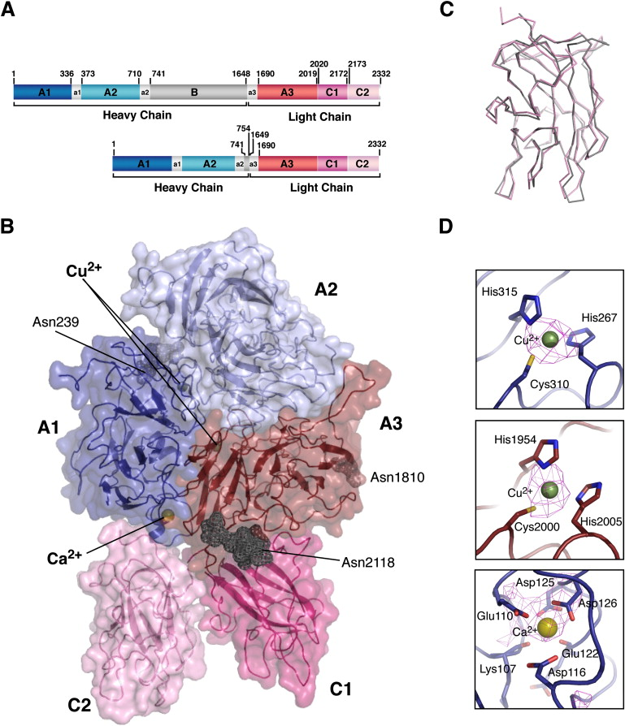

# 2024-1-P1-HemofiliaSeverityClassification

# Classificação de Severidade de Hemofilia

Este repositório contém o projeto de classificação da severidade de Hemofilia, utilizando dados relacionados à proteína Fator VIII (FVIII). O objetivo é analisar e prever a severidade da doença com base em características específicas da mutação da proteína.

## Conteúdo do Repositório

### 1. Artigo

O arquivo `Development of Machine Learning Models for Hemophilia A Severity Classification Based on FVIII Protein Mutations.pdf` neste repositório contém uma artigo sobre o tema, mostrando todo referencial teorico ,metodologias utilizadas e resultados e analises. 

### 2. Arquivos de Código

- **Hemofilia-Projeto1.ipynb**: Notebook Jupyter que contém o código principal para a geração dos resultados da classificação de severidade de Hemofilia. Este arquivo realiza o treinamento do modelo e a avaliação dos resultados.

- **ResultsHemophilia.ipynb**: Notebook Jupyter focado na criação de visualizações dos resultados obtidos e na realização de testes estatísticos. É aqui que os resultados do modelo são analisados de forma mais detalhada.

## Como Utilizar

Para utilizar este projeto, siga os passos abaixo:

1. Clone este repositório:

   '''
   git clone https://github.com/seu-usuario/nome-do-repositorio.git
   '''

2. Abra os notebooks Jupyter (`*.ipynb`) utilizando o Jupyter Notebook ou o Jupyter Lab.

3. Execute as células de código conforme necessário. Certifique-se de que todas as dependências estão instaladas (verifique o arquivo `requirements.txt` se existir).

4. Explore os resultados gerados pelo modelo de classificação e pelas visualizações estatísticas para obter insights sobre a severidade da Hemofilia com base nos dados da proteína FVIII.

## Contribuições

Contribuições são bem-vindas! Sinta-se à vontade para abrir issues para reportar problemas ou propor melhorias, e pull requests para contribuir com novas funcionalidades.

## Autores

- Vitor Berger Bonella
